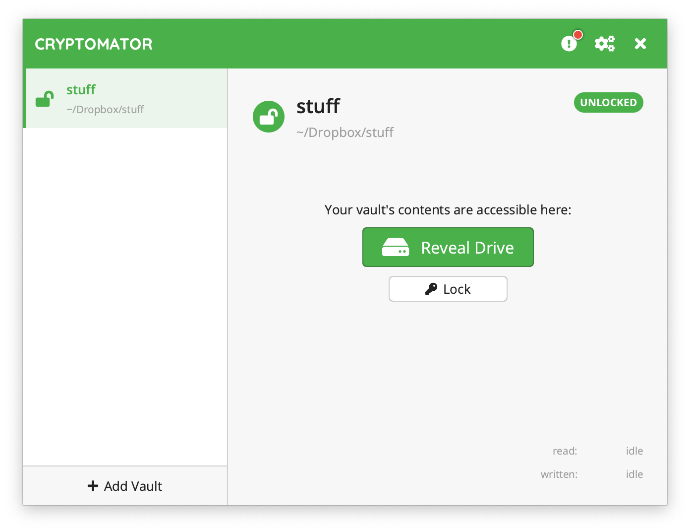

# Encrypting Cloud Storage

*Last Update: August 2020*

Cloud storage such as Dropbox and Google Drive are popular tools for activists to organize work and data, but an important concern is lack of native encryption in such cloud services, increasing security risks for files stored on the cloud. In this guide, we will discuss [Cryptomator](https://cryptomator.org/), a free and open-source program that allows you to automatically encrypt a folder on your desktop that will be automatically synced with the Dropbox service.

## Sign up for a free Dropbox account anonymously

As of writing, [Dropbox](https://www.dropbox.com/basic) offers a free service that gives users 2GB of storage they can access from anywhere. If you are mainly storing documents you are working on, with a few images, and spreadsheets, this should be enough storage capacity. An [earlier guide](https://handfoot.github.io/securitytips/) described how to register for a free Protonmail secure email account anonymously, so I recommend using that account to register for a free Dropbox account.

  

After you register, and confirm your email address, you need to download the Dropbox client (for macOS in my case), and install it. Select the local storage + sync option when you install, so you can work on your files offline, and sync with Dropbox whenever you are online (but don't allow Dropbox to access your Desktop, Docs, and other existing folders). Dropbox will create a folder called `Dropbox` in your home directory and will automatically sync when you are connected.

## Using Cryptomator

  

- Download the macOS client of [Cryptomator](https://cryptomator.org/) and install it.

- After you load the program, select “Create New Vault” and give your vault a name like “stuff” or whatever you want to name your encrypted folder.

- When asked “Where should Cryptomator store the encrypted files of your vault?” select Dropbox.

- Type in a password for encrypting your vault. Optionally you can write down a recovery code, but if you do so, make sure that no one will be able to obtain this recovery code in any circumstances, including a raid.

- Unlock the vault with your password, and reveal it.

Now your encrypted vault is presented as a filesystem-like drive (with the name you have chosen) that you can access in finder, just as if it is like an external USB drive (except it is encrypted on the cloud), and you can work directly in this vault on sensitive documents.

The encrypted representation of your vault is stored in your Dropbox folder. When you view it, you notice that it consists of encrypted filenames and encrypted files, which are stored in your Dropbox.

*This is how your vault is actually stored in the Dropbox cloud.*

If you have multiple computers, you can also sync and share the same encrypted vault across different computers, giving you access to the same set of files stored on your Dropbox, only with strong encryption. If you want to do this, you can select “Add Vault” and “Open Existing Vault” and open the vault you want to add in your Dropbox by locating the key file in the instructions. If you go this route, be mindful that it is intended for one person (you) to access the files at one time, not for multiple people to access and edit the files simultaneously.

<!--You can also create an alias to a folder inside your vault and put that alias on your Desktop for easy access.-->
**That's it. Please keep your sensitive files secure!**

---

*If you would like to help improve this article, feel free to leave your suggestions in [issues](https://github.com/handfoot/securitytips/issues/new), or email handfoot at protonmail dot com*
